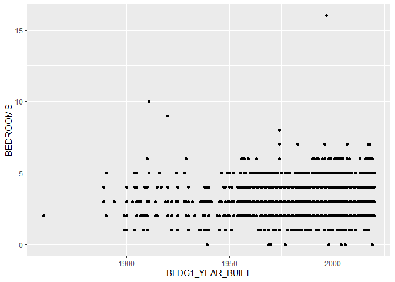
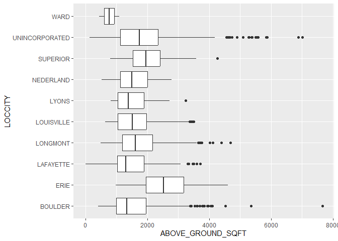
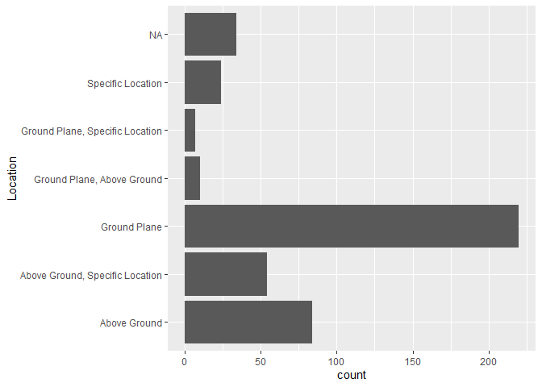
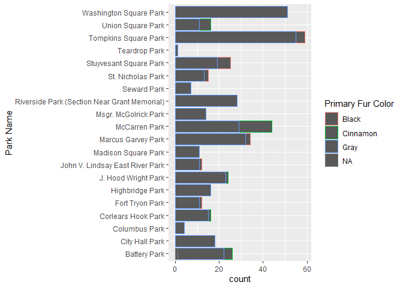

# Mini Data-Analysis: Deliverable 1
Thomas Nygaard

Total points available: 74

# Part 0: Getting Set Up

Let’s get ready to work on this assignment!

**0.1: Install Packages**

- Install the [`diversedata`](https://diverse-data-hub.github.io/)
  package by typing the following into your **R console**:

<!-- -->

    install.packages("pak")
    library(pak)
    pak::pak("diverse-data-hub/diversedata")

**0.2: Load Packages**

Typically, R Packages are loaded in at the very beginning of the
analysis. If you later want to use other packages, please come back and
add them here:

``` r
library(tidyverse)
#library(diversedata)
library(moderndive)
#--- Add any other packages below this line ---#
```

# Task 1: Choose a Data Set and Research Question

You may use one of the datasets from class or one of the datasets from
`diversedatahub`.

- **boulder-housing**: This data set contains housing information for
  the Boulder, Colorado area. *\[Add a second sentence here describing
  what the data covers — e.g., the variables included or what question
  it was collected to answer.\]*

- **squirrel-census**: Thes\[[great NYC squirrel
  census](https://www.thesquirrelcensus.com/),`squirrel-data.csv` –
  squirrel sightings recorded around Manhattan and Brooklyn parks.

- **rolling stone**: A [new visual
  essay](https://pudding.cool/2024/03/greatest-music/) from The Pudding
  compares Rolling Stone’s “500 Greatest Albums of All Time” lists from
  2003, 2012, and 2020. A methodology note says the project began with a
  spreadsheet by Chris Eckert and eventually led the authors to develop
  a dataset of their own. Theirs lists every album in the rankings — its
  name, genre, release year, 2003/2012/2020 rank, the artist’s name,
  birth year, gender, and more — plus each year’s voters. \[h/t Jason
  Kottke\]

- **coffee census**: In 2023, [British
  YouTuber](https://www.youtube.com/channel/UCMb0O2CdPBNi-QqPk5T3gsQ)
  (and former [World Barista
  Champion](https://www.jameshoffmann.co.uk/work#/coffee-competitions/))
  James Hoffman virtually hosted the [Great American Coffee Taste
  Test](https://www.youtube.com/watch?v=1fN_z4-EcOU), during which
  thousands of people simultaneously blind-tasted the same four coffees.
  Hoffman has published a [video summarizing the
  results](https://www.youtube.com/watch?v=bMOOQfeloH0), as well as [a
  spreadsheet of anonymized survey
  responses](https://bit.ly/gacttCSV+)from 4,000+ participants. It
  includes tasters’ demographics, general coffee drinking habits and
  preferences, assessments of the four coffees, and more. \[h/t Dan
  Brady\] (via
  [data-is-plural](https://www.data-is-plural.com/archive/2023-11-15-edition/))

- **wildfire**: This data set contains information on wildfires in
  Canada, compiled from official government sources under the Open
  Government Licence – Alberta. The data was gathered to monitor,
  assess, and respond to wildfire risks across different regions.
  Wildfires have far-reaching environmental, social, and economic
  consequences. From an equity and inclusion perspective, analyzing
  wildfire data can reveal geographic and resource-based disparities in
  detection and containment efforts, and highlight how certain
  populations face greater risks due to climate change and limited
  infrastructure. There are 26551 rows and 35 columns.

- **genderassessment**: Collected in 2023, the data allows for
  comparative evaluation across countries, sectors, and ownership types
  (e.g., Public, Private, Government). Each record represents a company
  and its corresponding evaluation across 28 detailed gender related
  indicators, offering a comprehensive snapshot of corporate gender
  equity worldwide. There are 2000 rows and 29 variables

- **hcmst**: This data set is adapted from the original data set [How
  Couples Meet and Stay Together 2017,
  2022](https://data.stanford.edu/hcmst2017). This study, led by
  researchers from Stanford University, surveyed 1,722 U.S. adults in
  2022 to explore how relationships form and change with time and
  focused on dating habits and the impact of the COVID-19 pandemic on
  relationships. This adapted data set focuses on variables that may
  affect the quality of the relationship, considering demographic
  characteristics of the subjects, couple dynamics, as well as
  COVID-19-related variables. The COVID-19 pandemic had a [significant
  impact](https://pmc.ncbi.nlm.nih.gov/articles/PMC10009005/) on
  romantic relationships in the United States. This data set enables
  exploration of how external factors, like the health of the subjects
  and changes in income, as well as personal behaviors, like conflict
  and intimate dynamics, relate to an individual’s perception of the
  quality of the relationship. There are 1328 rows and 21 columns.

- **womensmarchmadness**: This adapted data set contains historical
  records of every NCAA Division I Women’s Basketball Tournament
  appearance since the tournament began in 1982 up until 2018, capturing
  tournament results across more than four decades of collegiate women’s
  basketball. All data is sourced from the NCAA and contains the data
  behind the story [The Rise and Fall Of Women’s NCAA Tournament
  Dynasties](https://fivethirtyeight.com/features/louisiana-tech-was-the-uconn-of-the-80s/).
  The rise in popularity of the NCAA Women’s March Madness, fueled by
  athletes like Caitlin Clark and Paige Bueckers, reflects a broader
  cultural shift in the recognition of women’s sports. Beyond
  entertainment and athletic achievement, women’s participation in sport
  has social and professional benefits. There are 2092 rows and 20
  columns.

*Note: We encourage you to use one of the options above, but if you have
a data set that you’d really like to use, please check with a member of
the teaching team to see whether the data set is of appropriate
complexity. If approved, please add a brief description of the data
here.*

### 1.1: Choose 2 data sets **(2 points)**

Out of the 5 data sets listed above, choose **2** that appeal to you
based on their description. Write your choices below:

<!-------------------------- Start your work below ---------------------------->

1: Boulder Housing

2: Squirrel Census

<!----------------------------------------------------------------------------->

### 1.2: Explore the Data **(12 points)**

One way to narrowing down your selection is to *explore* the data sets.
Use your knowledge of `dplyr` to summarize three variables in each of
the data sets (for example, listing what levels of a categorical
variable exist, or calculating the mean of a continuous variable of
interest). Write a sentence that describes your findings for each
variable explored. You may use multiple R code chunks if preferred.

<!-------------------------- Start your work below ---------------------------->

#### Data Set 1

``` r
### Explore 3 variables of data set 1 ###

#Variables Explored: BLDG1_YEAR_BUILT, BEDROOM, ABOVE_GROUND_SQFT, LOCCITY

housingDf = read_csv('dat/boulder-2020-residential_sales.csv')
```

    Rows: 3052 Columns: 37
    ── Column specification ────────────────────────────────────────────────────────
    Delimiter: ","
    chr (24): Account #, PARCELNB, PROPERTY_ADDRESS, LOCCITY, SUBNAME, MULTIPLE_...
    dbl (13): Market
    Area 1, BLDG1_YEAR_BUILT, BEDROOMS, FULL_BATHS, THREE_QTR_B...

    ℹ Use `spec()` to retrieve the full column specification for this data.
    ℹ Specify the column types or set `show_col_types = FALSE` to quiet this message.

``` r
glimpse(housingDf)
```

    Rows: 3,052
    Columns: 37
    $ `Market\rArea 1`     <dbl> 101, 101, 106, 402, 404, 404, 405, 405, 632, 201,…
    $ `Account #`          <chr> "R0000908", "R0071420", "R0069754", "R0110294", "…
    $ PARCELNB             <chr> "146125304001", "146136416013", "157707417048", "…
    $ PROPERTY_ADDRESS     <chr> "2385 4TH ST", "1042 8TH ST", "1400 ROCKMONT CIR"…
    $ LOCCITY              <chr> "BOULDER", "BOULDER", "BOULDER", "SUPERIOR", "ERI…
    $ SUBNAME              <chr> "MAPLETON PARK - BO", "ROSE HILL - BO", "DEVILS T…
    $ MULTIPLE_BLDGS       <chr> "NO", "YES", "NO", "NO", "NO", "NO", "NO", "NO", …
    $ ACCOUNT_TYPE         <chr> "RESIDENTIAL", "RESIDENTIAL", "RESIDENTIAL", "RES…
    $ BLDG1_DESCRIPTION    <chr> "SINGLE FAM RES IMPROVEMENTS", "SINGLE FAM RES IM…
    $ BLDG1_DESIGN         <chr> "2-3 Story", "2-3 Story", "Split-level", "2-3 Sto…
    $ BLDG1_YEAR_BUILT     <dbl> 1969, 2000, 1978, 1991, 2019, 2019, 1983, 1997, 2…
    $ BEDROOMS             <dbl> 4, 5, 3, 4, 6, 5, 4, 4, 2, 4, 3, 1, 3, 3, 4, 5, 3…
    $ FULL_BATHS           <dbl> 1, 5, 2, 1, 2, 4, 1, 2, 1, 2, 1, 1, 1, 2, 2, 3, 2…
    $ THREE_QTR_BATHS      <dbl> 2, 0, 0, 2, 2, 0, 1, 1, 1, 0, 1, 0, 0, 0, 2, 0, 0…
    $ HALF_BATHS           <dbl> 1, 1, 0, 0, 1, 0, 0, 1, 0, 2, 0, 0, 1, 1, 0, 1, 1…
    $ ABOVE_GROUND_SQFT    <dbl> 2430, 2658, 1082, 2212, 4356, 3084, 924, 1825, 17…
    $ FINISHED_BSMT_SQFT   <dbl> 617, 1117, 552, 316, 0, 0, 484, 572, 0, 600, 676,…
    $ UNFINISHED_BSMT_SQFT <dbl> 0, 625, 0, 315, 1088, 1456, 0, 24, 0, 0, 0, 0, 14…
    $ GARAGE_SQFT          <dbl> 536, 462, 460, 680, 764, 700, 440, 440, 504, 0, 0…
    $ FINISHED_GARAGE_SQFT <dbl> 0, 0, 0, 0, 0, 0, 0, 0, 0, 0, 0, 0, 0, 0, 0, 0, 0…
    $ STUDIO_SQFT          <dbl> 0, 330, 0, 0, 0, 0, 0, 0, 0, 0, 0, 0, 0, 0, 0, 0,…
    $ OTHER_BLDGS          <dbl> 0, 0, 0, 0, 0, 0, 0, 0, 0, 0, 0, 0, 1296, 0, 0, 0…
    $ RECEPTION_NO         <chr> "3759055", "3760750", "3758316", "3759154", "3759…
    $ SALE_DATE            <chr> "1/2/20", "1/2/20", "1/2/20", "1/2/20", "1/2/20",…
    $ SALE_PRICE           <chr> "$1,750,000", "$1,842,000", "$1,200,000", "$610,0…
    $ `Grantor 1`          <chr> "AMACKER LESLIE E", "BYRN MONICA MARGO & GORDON S…
    $ `Grantee 1`          <chr> "DUFOUR JEFFREY W & CECILIA C DALEY", "2B9 8TH ST…
    $ OWNER_NAME           <chr> "DUFOUR JEFFREY W & CECILIA C DALEY", "2B9 8TH ST…
    $ CARE_OF              <chr> NA, NA, NA, NA, NA, NA, NA, NA, NA, NA, NA, NA, N…
    $ MAILING_ADDR1        <chr> "2385 4TH ST", "1623 CENTRAL AVE STE 204", "10705…
    $ MAILING_ADDR2        <chr> NA, NA, NA, NA, NA, NA, NA, NA, NA, NA, NA, NA, N…
    $ CITY                 <chr> "BOULDER", "CHEYENNE", "CHARLOTTE", "SUPERIOR", "…
    $ STATE                <chr> "CO", "WY", "NC", "CO", "CO", "CO", "CO", "CO", "…
    $ ZIPCODE              <chr> "80302", "82001", "28277", "80027-8024", "80516",…
    $ LAND_VALUE           <chr> "$1,102,000", "$1,035,000", "$690,000", "$358,000…
    $ BLDG_VALUE           <chr> "$915,600", "$807,000", "$266,000", "$256,700", "…
    $ EXTRA_FEATURE_VALUE  <chr> "$0", "$0", "$0", "$0", "$0", "$0", "$0", "$0", "…

``` r
housingDf |>
  ggplot(aes(BLDG1_YEAR_BUILT, BEDROOMS)) +
  geom_point()
```



``` r
housingDf |>
  ggplot(aes(ABOVE_GROUND_SQFT, LOCCITY)) +
  geom_boxplot()
```



There is no clear relationship between year build and the amount of
bedrooms per house. The amount of bedrooms tends to be less than 6,
however there are some outliers. The highest mean above ground sqft is
located in Erie, and the lowest mean above ground sqft is located in
Ward.

#### Data Set 2

``` r
### Explore 3 variables of data set 2 ###

#Variables explored: Location, Park Name, Primary Fur Color

squirrelDf = read_csv('dat/squirrel-data.csv')
```

    Rows: 433 Columns: 16
    ── Column specification ────────────────────────────────────────────────────────
    Delimiter: ","
    chr (14): Area Name, Area ID, Park Name, Park ID, Squirrel ID, Primary Fur C...
    dbl  (2): Squirrel Latitude (DD.DDDDDD), Squirrel Longitude (-DD.DDDDDD)

    ℹ Use `spec()` to retrieve the full column specification for this data.
    ℹ Specify the column types or set `show_col_types = FALSE` to quiet this message.

``` r
glimpse(squirrelDf)
```

    Rows: 433
    Columns: 16
    $ `Area Name`                       <chr> "UPPER MANHATTAN", "UPPER MANHATTAN"…
    $ `Area ID`                         <chr> "A", "A", "A", "A", "A", "A", "A", "…
    $ `Park Name`                       <chr> "Fort Tryon Park", "Fort Tryon Park"…
    $ `Park ID`                         <chr> "01", "01", "01", "01", "01", "01", …
    $ `Squirrel ID`                     <chr> "A-01-01", "A-01-02", "A-01-03", "A-…
    $ `Primary Fur Color`               <chr> "Gray", "Gray", "Gray", "Gray", "Gra…
    $ `Highlights in Fur Color`         <chr> "White", "White", "White", "White", …
    $ `Color Notes`                     <chr> NA, NA, NA, NA, NA, NA, NA, NA, NA, …
    $ Location                          <chr> "Ground Plane", "Ground Plane", "Gro…
    $ `Above Ground (Height in Feet)`   <chr> NA, NA, NA, NA, NA, NA, NA, "10", NA…
    $ `Specific Location`               <chr> NA, NA, NA, NA, NA, NA, NA, NA, NA, …
    $ Activities                        <chr> "Foraging", "Foraging", "Eating, Dig…
    $ `Interactions with Humans`        <chr> "Indifferent", "Indifferent", "Indif…
    $ `Other Notes or Observations`     <chr> NA, "Looks skinny", NA, NA, "She lef…
    $ `Squirrel Latitude (DD.DDDDDD)`   <dbl> 40.85941, 40.85944, 40.85942, 40.859…
    $ `Squirrel Longitude (-DD.DDDDDD)` <dbl> -73.93394, -73.93394, -73.93389, -73…

``` r
squirrelDf |>
  ggplot(aes(x =`Location`)) +
  geom_bar() + 
  coord_flip()
```



``` r
squirrelDf |>
  ggplot(aes(x=`Park Name`, color = `Primary Fur Color`)) +
  geom_bar() +
  coord_flip()
```



A majority of squirrels are located on the Ground plane. In Washington
Square park all of the squirrels have Gray fur color. All of the parks
contain some Gray squirrels, McCarren park contains the most Cinnamon
fur colored squirrels.

<!----------------------------------------------------------------------------->

### 1.3: Choose 1 Data Set **(2 points)**

It’s time to choose only one data set. State the data set that you’ve
chosen, and why you’ve chosen it.

<!-------------------------- Start your work below ---------------------------->

I have chosen the Boulder Housing data set. I selected Boulder Housing
because I believe it has better/more valuable data when compared to the
squirrel data set.

<!----------------------------------------------------------------------------->

### 1.4: Research Question **(4 points)**

Let’s choose a primary and a secondary research question to explore.

Write your research questions **as questions**, and be specific. You can
change it later if needed.

> For example, if I had chosen a `titanic` data set for my project, I
> might ask, “(Primary) Is there a relationship between survival and the
> class of the passengers? (Secondary) Does this relationship differ by
> gender?”

<!-------------------------- Start your work below ---------------------------->

Is there a relationship between Location/City and the land value? Does
the land value then result in larger homes/more above ground sqft?

<!----------------------------------------------------------------------------->

### 1.5: Commit **(2 points)**

Commit your work and push it to GitHub. Include an informative commit
message, and include “(1.5)” in the message.

# Task 2: Further Exploring Your Chosen Data Set

### 2.1: Missing Data **(6 points)**

Missing data is inevitable, and can complicate analyses. Let’s see what
variables (if any) have missing data in your chosen data set.

Your task is to create a table that calculates the proportion of missing
values per variable. Be sure to output the table.

<!-------------------------- Start your work below ---------------------------->

``` r
### Explore missingness here ###
missing <- data.frame(
  Proportion_Missing = round(colMeans(is.na(housingDf)),3)
)

#Displays all the Variables and their proportion of missing values
print(missing)
```

                         Proportion_Missing
    Market\rArea 1                    0.000
    Account #                         0.000
    PARCELNB                          0.000
    PROPERTY_ADDRESS                  0.000
    LOCCITY                           0.000
    SUBNAME                           0.000
    MULTIPLE_BLDGS                    0.000
    ACCOUNT_TYPE                      0.000
    BLDG1_DESCRIPTION                 0.000
    BLDG1_DESIGN                      0.000
    BLDG1_YEAR_BUILT                  0.000
    BEDROOMS                          0.000
    FULL_BATHS                        0.000
    THREE_QTR_BATHS                   0.000
    HALF_BATHS                        0.000
    ABOVE_GROUND_SQFT                 0.000
    FINISHED_BSMT_SQFT                0.000
    UNFINISHED_BSMT_SQFT              0.000
    GARAGE_SQFT                       0.000
    FINISHED_GARAGE_SQFT              0.000
    STUDIO_SQFT                       0.000
    OTHER_BLDGS                       0.000
    RECEPTION_NO                      0.000
    SALE_DATE                         0.000
    SALE_PRICE                        0.000
    Grantor 1                         0.001
    Grantee 1                         0.000
    OWNER_NAME                        0.000
    CARE_OF                           0.996
    MAILING_ADDR1                     0.000
    MAILING_ADDR2                     0.999
    CITY                              0.000
    STATE                             0.000
    ZIPCODE                           0.000
    LAND_VALUE                        0.000
    BLDG_VALUE                        0.000
    EXTRA_FEATURE_VALUE               0.000

``` r
#Filters to show only the variables with missing values
print(missing) |>
  filter(Proportion_Missing != 0.000)
```

                         Proportion_Missing
    Market\rArea 1                    0.000
    Account #                         0.000
    PARCELNB                          0.000
    PROPERTY_ADDRESS                  0.000
    LOCCITY                           0.000
    SUBNAME                           0.000
    MULTIPLE_BLDGS                    0.000
    ACCOUNT_TYPE                      0.000
    BLDG1_DESCRIPTION                 0.000
    BLDG1_DESIGN                      0.000
    BLDG1_YEAR_BUILT                  0.000
    BEDROOMS                          0.000
    FULL_BATHS                        0.000
    THREE_QTR_BATHS                   0.000
    HALF_BATHS                        0.000
    ABOVE_GROUND_SQFT                 0.000
    FINISHED_BSMT_SQFT                0.000
    UNFINISHED_BSMT_SQFT              0.000
    GARAGE_SQFT                       0.000
    FINISHED_GARAGE_SQFT              0.000
    STUDIO_SQFT                       0.000
    OTHER_BLDGS                       0.000
    RECEPTION_NO                      0.000
    SALE_DATE                         0.000
    SALE_PRICE                        0.000
    Grantor 1                         0.001
    Grantee 1                         0.000
    OWNER_NAME                        0.000
    CARE_OF                           0.996
    MAILING_ADDR1                     0.000
    MAILING_ADDR2                     0.999
    CITY                              0.000
    STATE                             0.000
    ZIPCODE                           0.000
    LAND_VALUE                        0.000
    BLDG_VALUE                        0.000
    EXTRA_FEATURE_VALUE               0.000

                  Proportion_Missing
    Grantor 1                  0.001
    CARE_OF                    0.996
    MAILING_ADDR2              0.999

<!----------------------------------------------------------------------------->

### 2.2: Missing Data (Again) **(6 points)**

Based on your research question, will this missingness pose an issue?
For the purposes of this class (and this class only!), we will consider
missingness a problem **if there is more than 20% of a single variable
(that is of interest) is missing**.

> For example, let’s assume I wanted to explore the following research
> questions: “Is there a relationship between survival and the class of
> the passengers? Does this relationship vary by gender?”. If the
> variable indicating whether or not a person survived was missing for
> 20% or more of the passengers, then this would be a problem. However,
> if a variable indicating the colour of shirt a passenger was wearing
> was missing, this probably wouldn’t be an issue as that variable is
> quite irrelevant to my analysis!

Based on this definition, is missingness an issue for your analysis? If
so, describe how you will address this (pivoting your research question,
for example). If you will continue with a new research question, write
it here! **Do not go back to Task 1 and redo the analysis.** ).

If missingness is not an issue, describe why.

<!-------------------------- Start your work below ---------------------------->

No missingness will not be an issue for me in this data analysis. The
missing data in the boulder housing is within the variables Grantor 1,
Care of, and Mailing address 2. These variables are not applicable to
the land value, sqft, or location so my analysis will not be affected by
the missing values.
<!----------------------------------------------------------------------------->

### 2.3: Tidy your Data **(10 points)**

Produce a tidy data set that could be used to answer your research
questions. **Please ensure you have at least one quantitative (numeric)
and one categorical variable in your data set. It’s okay you need to
include a less relevant variable in your tidied data to ensure this.**

To tidy your data, you should:

- Create new variables (if needed)

- Transform the data into a tidy form (if needed)

- Remove irrelevant columns (if needed)

- Comment your code throughout

Show the first 6 rows of the tidied data.

<!-------------------------- Start your work below ---------------------------->

``` r
#Keeping only the important columns
#The columns are already in tidy form (columns are variables)
housingTidy <- housingDf |>
  select(LOCCITY, LAND_VALUE, ABOVE_GROUND_SQFT)

#Removing the "$" at the beginning of the land values, then converting the land values to integers wile removing the commas.
housingTidy <- housingTidy |>
  mutate(LAND_VALUE = as.integer(gsub(",", "", substring(LAND_VALUE,2))))

head(housingTidy, 6)
```

    # A tibble: 6 × 3
      LOCCITY  LAND_VALUE ABOVE_GROUND_SQFT
      <chr>         <int>             <dbl>
    1 BOULDER     1102000              2430
    2 BOULDER     1035000              2658
    3 BOULDER      690000              1082
    4 SUPERIOR     358000              2212
    5 ERIE          99000              4356
    6 ERIE          87000              3084

<!----------------------------------------------------------------------------->

### 2.4: Create a Table (10 points)

Use any functions from the `tidyverse` to create one table that outputs
the mean, minimum, and maximum of all numeric columns in your data,
dropping the missing values if they exist.

Show the outputted table.

<!-------------------------- Start your work below ---------------------------->

``` r
housingTidy |>
  summarize(meanLandValue = mean(LAND_VALUE, na.rm = TRUE), minLandValue = min(LAND_VALUE,na.rm = TRUE), maxLandValue= max(LAND_VALUE, na.rm = TRUE), meanAboveSqft = mean(ABOVE_GROUND_SQFT, na.rm = TRUE), minAboveSqft = min(ABOVE_GROUND_SQFT, na.rm=TRUE), maxAboveSqft = max(ABOVE_GROUND_SQFT, na.rm = TRUE))
```

    # A tibble: 1 × 6
      meanLandValue minLandValue maxLandValue meanAboveSqft minAboveSqft
              <dbl>        <int>        <int>         <dbl>        <dbl>
    1       174552.            0      2678000         1788.            0
    # ℹ 1 more variable: maxAboveSqft <dbl>

<!----------------------------------------------------------------------------->

### 2.5: Commit **(2 points)**

Commit your work and push it to GitHub. , and include “(2.7)” in the
message.

# Task 3: Tidy Your Submission Overall

Check over your document and GitHub repository for the following:

### 3.1: Coherence **(2 points)**

The document should read sensibly from top to bottom, with no major
continuity errors. An example of a major continuity error is having a
data set listed for Task 3 that is not part of one of the data sets
listed in Task 1.

### 3.2: Error-free code **(2 points)**

For full marks, all code in the document should run without error and be
completely reproducible.

### 3.3 README **(6 points)**

There should be a file named `README.md` at the top level of your
repository. Its contents should automatically appear when you visit the
repository on GitHub.

Minimum contents of the README file:

- In a sentence or two, explains what this repository is, so that
  future-you or someone else stumbling on your repository can be
  oriented to the repository.
- List the files/folders contained in the repository
- In a sentence or two, briefly explains how to engage with the
  repository. You can assume the person reading knows the material from
  STAT 545A. Basically, if a visitor to your repository wants to explore
  your project, what should they know? How can they reproduce your
  report?

### 3.4 Generative AI Disclosure **(3 points)**

In this course, Generative AI can be used in the following ways:

- to clarify concepts discussed in class

- as an “advanced search engine” (i.e., searching error codes)

- debugging code that students wrote and attempted to debug on their own

Generative AI **CANNOT** be used to generate text or code (including
comments) from scratch.

Any use of Generative AI must be disclosed.

**To disclose your use, please copy and paste the following template
into the README of your GitHub Repository and fill out the relevant
details** \[in square brackets\]. BE SPECIFIC. Saying you used it to
debug your code is not enough. Explicitly describe where you got stuck

Here is an example of a specific, explicit debug:

> “I had the error `attempt to apply non-function` after running my
> code. I used Claude to help me identify that this error was due to me
> attempting to multiply two numbers together without the use of a `*`,
> i.e. `(2)(3)` instead of `2*3`.”

``` markdown

## Generative AI Statement

Generative AI (through [LIST MODELS USED, i.e. ChatGPT, CoPilot)] was used to
help me complete  this assignment in the following ways.

1. [Describe here]

2. [Describe here]

...

I affirm that Generative AI was not used to generate text, code, or comments for
my assessments.
```

If you did not use Generative AI, please include the following in your
README:

``` markdown

## Generative AI Statement

Generative AI was not used in any way throughout this assignment.
```

Assessments suspected of having AI-generated text and/or code, or
assignments where the Generative AI use was not disclosed, will be
flagged and temporarily assigned a grade of zero. Students will be
required to meet with the instructor to receive a grade.

### 3.5 Output **(4 points)**

All output on GitHub is readable, recent and relevant:

- All `.qmd` files have been rendered to their output `.md` files.
- All rendered `.md` files are viewable without errors on Github.
  Examples of errors: Missing plots, “Sorry about that, but we can’t
  show files that are this big right now” messages, error messages from
  broken R code
- All of these output files are up-to-date – that is, they haven’t
  fallen behind after the source (`.qmd`) files have been updated.
- There should be no relic output files. For example, if you were
  rendering a `.qmd` to `.html`, but then changed the output to be only
  a markdown file, then the `.html` file is a relic and should be
  deleted.

# Step 4: Submission

\*\* Submit repo link \*\*

To submit this milestone, submit the github link to the repo.

This assignment was authored by the team of instructors at University of
British Colombia’s STA 545 class.
